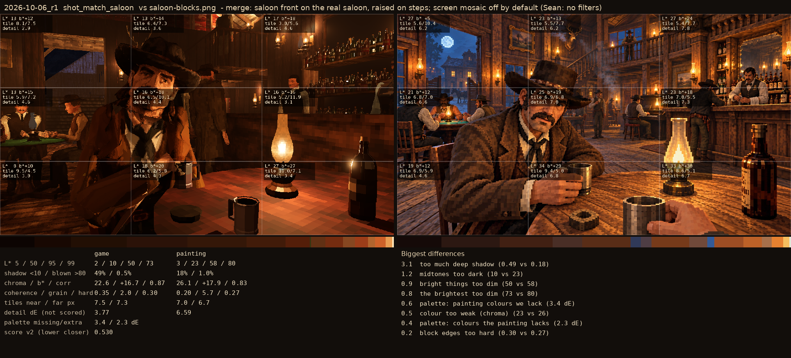
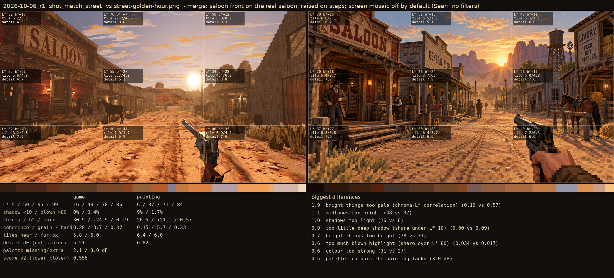

# 2026-10-06_r1: merge: saloon front on the real saloon, raised on steps; screen mosaic off by default (Sean: no filters)

## shot_match_saloon (score 0.530, lower is closer)

- 3.1 too much deep shadow (0.49 vs 0.18)
- 1.2 midtones too dark (10 vs 23)
- 0.9 bright things too dim (50 vs 58)
- 0.8 the brightest too dim (73 vs 80)
- 0.6 palette: painting colours we lack (3.4 dE)
- 0.5 colour too weak (chroma) (23 vs 26)
- 0.4 palette: colours the painting lacks (2.3 dE)
- 0.2 block edges too hard (0.30 vs 0.27)

## shot_match_street (score 0.556, lower is closer)

- 1.9 bright things too pale (chroma-L* correlation) (0.19 vs 0.57)
- 1.1 midtones too bright (48 vs 37)
- 1.0 shadows too light (16 vs 6)
- 0.9 too little deep shadow (share under L* 10) (0.00 vs 0.09)
- 0.7 bright things too bright (78 vs 71)
- 0.6 too much blown highlight (share over L* 80) (0.034 vs 0.017)
- 0.6 colour too strong (31 vs 27)
- 0.5 palette: colours the painting lacks (3.0 dE)
