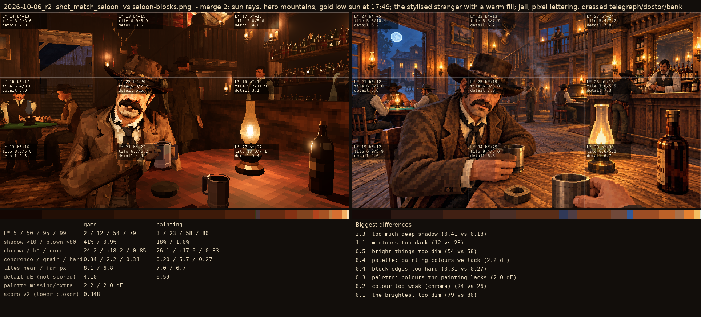
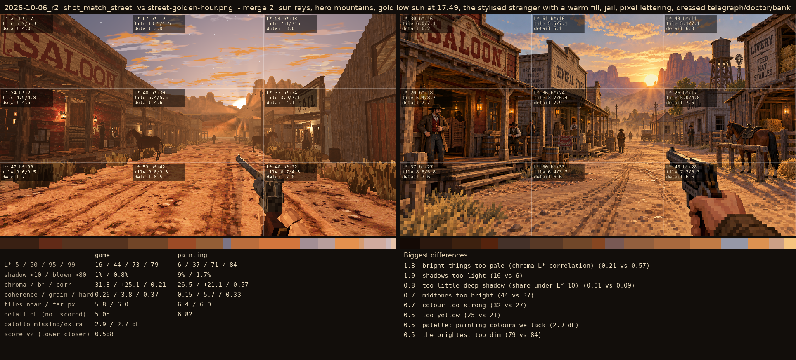

# 2026-10-06_r2: merge 2: sun rays, hero mountains, gold low sun at 17:49; the stylised stranger with a warm fill; jail, pixel lettering, dressed telegraph/doctor/bank

## shot_match_saloon (score 0.348, lower is closer)

- 2.3 too much deep shadow (0.41 vs 0.18)
- 1.1 midtones too dark (12 vs 23)
- 0.5 bright things too dim (54 vs 58)
- 0.4 palette: painting colours we lack (2.2 dE)
- 0.4 block edges too hard (0.31 vs 0.27)
- 0.3 palette: colours the painting lacks (2.0 dE)
- 0.2 colour too weak (chroma) (24 vs 26)
- 0.1 the brightest too dim (79 vs 80)

## shot_match_street (score 0.508, lower is closer)

- 1.8 bright things too pale (chroma-L* correlation) (0.21 vs 0.57)
- 1.0 shadows too light (16 vs 6)
- 0.8 too little deep shadow (share under L* 10) (0.01 vs 0.09)
- 0.7 midtones too bright (44 vs 37)
- 0.7 colour too strong (32 vs 27)
- 0.5 too yellow (25 vs 21)
- 0.5 palette: painting colours we lack (2.9 dE)
- 0.5 the brightest too dim (79 vs 84)
