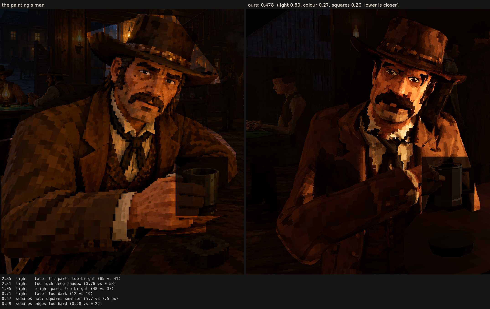

# Character judge, 2026-10-06_r1

this morning: squares painted into his 2048 atlas, lit smoothly across them

Score **0.478** (the mean severity; lower is closer): light 0.804, colour 0.273, squares 0.263. From `docs/screenshots/tripo/judge/renders/before`.

| Severity | Group | Difference |
|---|---|---|
| 2.35 | light | face: lit parts too bright (65 vs 41) |
| 2.31 | light | too much deep shadow (0.76 vs 0.53) |
| 1.05 | light | bright parts too bright (48 vs 37) |
| 0.71 | light | face: too dark (12 vs 19) |
| 0.67 | squares | hat: squares smaller (5.7 vs 7.5 px) |
| 0.59 | squares | edges too hard (0.28 vs 0.22) |
| 0.57 | light | coat: too dark (3 vs 9) |
| 0.56 | light | midtones too dark (4 vs 9) |
| 0.54 | colour | coat: colour too weak (14 vs 18) |
| 0.52 | light | hat: lit parts too bright (28 vs 23) |
| 0.44 | squares | squares too different from their neighbours (5.7 vs 4.4) |
| 0.44 | squares | squares flatter than the painting's (one tone, edge to edge) (0.70 vs 0.65) |
| 0.37 | colour | too blue/grey (b*) (12 vs 15) |
| 0.36 | colour | colour too weak (chroma) (16 vs 19) |
| 0.33 | light | coat: lit parts too bright (30 vs 27) |
| 0.31 | colour | face: colour too weak (28 vs 31) |
| 0.25 | light | hat: too dark (5 vs 7) |
| 0.25 | colour | palette: the painting's colours we lack (1.5 dE) |
| 0.20 | colour | hat: colour too strong (16 vs 15) |
| 0.18 | light | too much blown highlight (share over L* 80) (0.005 vs 0.000) |
| 0.14 | colour | palette: colours the painting lacks (0.8 dE) |
| 0.13 | squares | squares smaller than the painting's (7.5 vs 7.9 px) |
| 0.10 | squares | face: squares smaller (6.7 vs 6.9 px) |
| 0.01 | light | shadows too light (0 vs 0) |
| 0.01 | colour | bright parts too pale (chroma-L* correlation) (0.92 vs 0.92) |
| 0.00 | squares | noisier than paint (coherence 0.37 vs 0.28) |
| 0.00 | squares | grain in his flat parts (1.9 vs 3.0 dE) |
| 0.00 | squares | coat: squares bigger (8.2 vs 8.2 px) |

