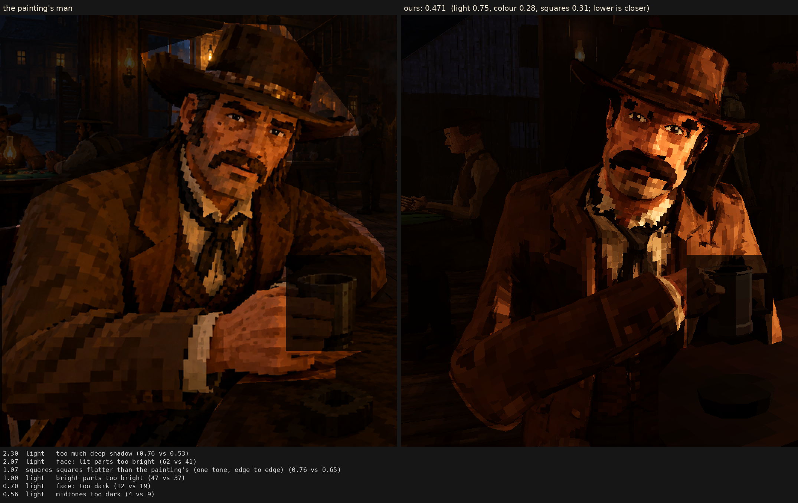

# Character judge, 2026-10-06_r2

now: his texture a texel a square, each square lit as one

Score **0.471** (the mean severity; lower is closer): light 0.746, colour 0.275, squares 0.309. From `docs/screenshots/tripo/judge/renders/now`.

| Severity | Group | Difference |
|---|---|---|
| 2.30 | light | too much deep shadow (0.76 vs 0.53) |
| 2.07 | light | face: lit parts too bright (62 vs 41) |
| 1.07 | squares | squares flatter than the painting's (one tone, edge to edge) (0.76 vs 0.65) |
| 1.00 | light | bright parts too bright (47 vs 37) |
| 0.70 | light | face: too dark (12 vs 19) |
| 0.56 | light | midtones too dark (4 vs 9) |
| 0.56 | light | coat: too dark (3 vs 9) |
| 0.56 | squares | edges too hard (0.28 vs 0.22) |
| 0.54 | colour | coat: colour too weak (14 vs 18) |
| 0.44 | squares | hat: squares smaller (6.2 vs 7.5 px) |
| 0.40 | squares | squares too different from their neighbours (5.6 vs 4.4) |
| 0.37 | colour | colour too weak (chroma) (16 vs 19) |
| 0.37 | colour | too blue/grey (b*) (12 vs 15) |
| 0.33 | colour | face: colour too weak (28 vs 31) |
| 0.31 | light | hat: lit parts too bright (26 vs 23) |
| 0.27 | light | hat: too dark (4 vs 7) |
| 0.25 | light | coat: lit parts too bright (29 vs 27) |
| 0.25 | colour | palette: the painting's colours we lack (1.5 dE) |
| 0.20 | colour | hat: colour too strong (16 vs 15) |
| 0.18 | light | too much blown highlight (share over L* 80) (0.006 vs 0.000) |
| 0.15 | squares | squares smaller than the painting's (7.4 vs 7.9 px) |
| 0.13 | colour | palette: colours the painting lacks (0.8 dE) |
| 0.12 | squares | face: squares smaller (6.6 vs 6.9 px) |
| 0.04 | squares | coat: squares smaller (8.1 vs 8.2 px) |
| 0.01 | light | shadows too light (0 vs 0) |
| 0.01 | colour | bright parts too pale (chroma-L* correlation) (0.92 vs 0.92) |
| 0.00 | squares | noisier than paint (coherence 0.38 vs 0.28) |
| 0.00 | squares | grain in his flat parts (1.8 vs 3.0 dE) |

