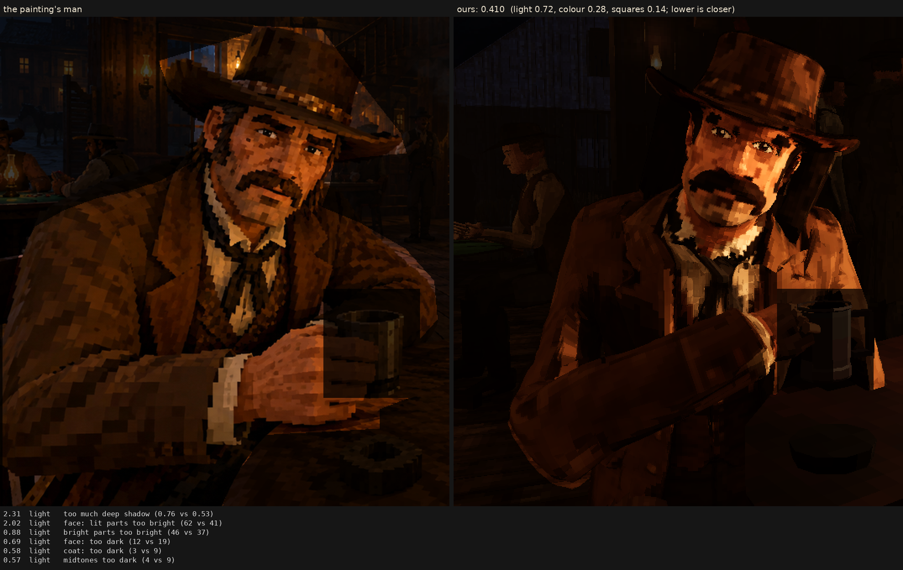

# Character judge, 2026-10-06_r3

soft squares: each square calmed toward its near-coloured neighbours, its edge texels leaning toward the next (body and hair three texels a square)

Score **0.410** (the mean severity; lower is closer): light 0.724, colour 0.279, squares 0.142. From `docs/screenshots/tripo/judge/renders/soft`.

| Severity | Group | Difference |
|---|---|---|
| 2.31 | light | too much deep shadow (0.76 vs 0.53) |
| 2.02 | light | face: lit parts too bright (62 vs 41) |
| 0.88 | light | bright parts too bright (46 vs 37) |
| 0.69 | light | face: too dark (12 vs 19) |
| 0.58 | light | coat: too dark (3 vs 9) |
| 0.57 | light | midtones too dark (4 vs 9) |
| 0.56 | colour | coat: colour too weak (14 vs 18) |
| 0.40 | squares | edges too hard (0.26 vs 0.22) |
| 0.39 | colour | colour too weak (chroma) (16 vs 19) |
| 0.39 | colour | too blue/grey (b*) (11 vs 15) |
| 0.34 | squares | squares too different from their neighbours (5.4 vs 4.4) |
| 0.33 | colour | face: colour too weak (28 vs 31) |
| 0.27 | light | hat: too dark (4 vs 7) |
| 0.25 | colour | palette: the painting's colours we lack (1.5 dE) |
| 0.24 | light | hat: lit parts too bright (25 vs 23) |
| 0.22 | light | coat: lit parts too bright (29 vs 27) |
| 0.21 | squares | coat: squares bigger (9.0 vs 8.2 px) |
| 0.17 | light | too much blown highlight (share over L* 80) (0.005 vs 0.000) |
| 0.16 | colour | hat: colour too strong (16 vs 15) |
| 0.14 | colour | palette: colours the painting lacks (0.9 dE) |
| 0.14 | squares | face: squares bigger (7.4 vs 6.9 px) |
| 0.12 | squares | squares bigger than the painting's (8.3 vs 7.9 px) |
| 0.06 | squares | squares not flat (light runs across them) (0.65 vs 0.65) |
| 0.01 | light | shadows too light (0 vs 0) |
| 0.01 | colour | bright parts too colourful (0.92 vs 0.92) |
| 0.01 | squares | hat: squares smaller (7.4 vs 7.5 px) |
| 0.00 | squares | noisier than paint (coherence 0.39 vs 0.28) |
| 0.00 | squares | grain in his flat parts (1.4 vs 3.0 dE) |

