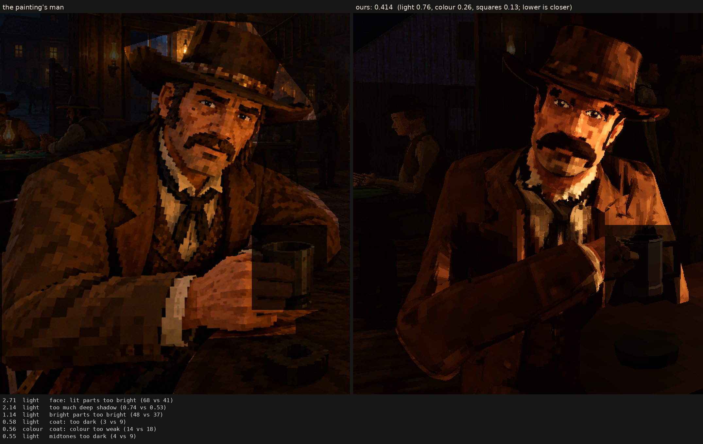

# Character judge, 2026-10-06_r4

the long hair taken off (Sean: it looked silly); his own short hair from his picture

Score **0.414** (the mean severity; lower is closer): light 0.757, colour 0.259, squares 0.132. From `docs/screenshots/tripo/judge/renders/nohair`.

| Severity | Group | Difference |
|---|---|---|
| 2.71 | light | face: lit parts too bright (68 vs 41) |
| 2.14 | light | too much deep shadow (0.74 vs 0.53) |
| 1.14 | light | bright parts too bright (48 vs 37) |
| 0.58 | light | coat: too dark (3 vs 9) |
| 0.56 | colour | coat: colour too weak (14 vs 18) |
| 0.55 | light | midtones too dark (4 vs 9) |
| 0.45 | squares | squares too different from their neighbours (5.7 vs 4.4) |
| 0.40 | squares | edges too hard (0.26 vs 0.22) |
| 0.30 | colour | too blue/grey (b*) (12 vs 15) |
| 0.29 | light | hat: lit parts too bright (26 vs 23) |
| 0.26 | colour | colour too weak (chroma) (17 vs 19) |
| 0.25 | light | hat: too dark (5 vs 7) |
| 0.25 | colour | face: colour too strong (33 vs 31) |
| 0.24 | colour | palette: the painting's colours we lack (1.4 dE) |
| 0.24 | colour | hat: colour too strong (17 vs 15) |
| 0.23 | light | too much blown highlight (share over L* 80) (0.007 vs 0.000) |
| 0.22 | light | coat: lit parts too bright (29 vs 27) |
| 0.21 | squares | coat: squares bigger (9.0 vs 8.2 px) |
| 0.20 | light | face: too dark (17 vs 19) |
| 0.20 | colour | palette: colours the painting lacks (1.2 dE) |
| 0.08 | squares | squares not flat (light runs across them) (0.65 vs 0.65) |
| 0.05 | squares | squares bigger than the painting's (8.0 vs 7.9 px) |
| 0.02 | light | shadows too light (1 vs 0) |
| 0.02 | colour | bright parts too pale (chroma-L* correlation) (0.92 vs 0.92) |
| 0.00 | squares | noisier than paint (coherence 0.39 vs 0.28) |
| 0.00 | squares | grain in his flat parts (1.4 vs 3.0 dE) |
| 0.00 | squares | face: squares smaller (6.9 vs 6.9 px) |
| 0.00 | squares | hat: squares bigger (7.5 vs 7.5 px) |

