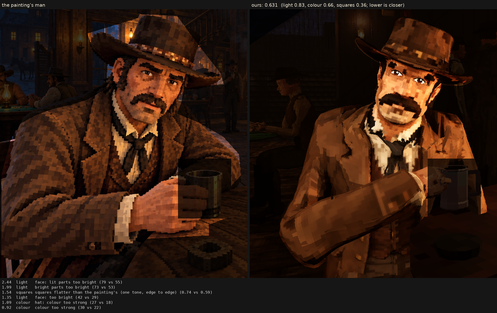

# Character judge, 2026-10-07_r1

round r4's man (squares calmed and soft, no long hair) under the art session's merge-2 light (its ViewerFill and eye gain, applied for the render only)

Score **0.631** (the mean severity; lower is closer): light 0.831, colour 0.663, squares 0.358. From `docs/screenshots/tripo/judge/renders/before_artlight`, against the man in `saloon-blocks.png`.

| Severity | Group | Difference |
|---|---|---|
| 2.44 | light | face: lit parts too bright (79 vs 55) |
| 1.99 | light | bright parts too bright (73 vs 53) |
| 1.54 | squares | squares flatter than the painting's (one tone, edge to edge) (0.74 vs 0.59) |
| 1.35 | light | face: too bright (42 vs 29) |
| 1.09 | colour | hat: colour too strong (27 vs 18) |
| 0.92 | colour | colour too strong (30 vs 22) |
| 0.89 | colour | coat: colour too strong (28 vs 21) |
| 0.88 | colour | too yellow (24 vs 17) |
| 0.79 | light | too much blown highlight (share over L* 80) (0.024 vs 0.001) |
| 0.74 | light | too little deep shadow (share under L* 10) (0.23 vs 0.31) |
| 0.62 | light | coat: lit parts too bright (47 vs 40) |
| 0.56 | colour | face: colour too strong (39 vs 34) |
| 0.47 | squares | edges too hard (0.30 vs 0.25) |
| 0.43 | light | hat: too bright (17 vs 13) |
| 0.43 | colour | bright parts too pale (chroma-L* correlation) (0.81 vs 0.89) |
| 0.40 | squares | squares too different from their neighbours (7.6 vs 6.5) |
| 0.37 | squares | hat: squares smaller (6.9 vs 8.0 px) |
| 0.33 | light | midtones too bright (20 vs 17) |
| 0.33 | light | coat: too bright (20 vs 17) |
| 0.29 | colour | palette: colours the painting lacks (1.7 dE) |
| 0.24 | colour | palette: the painting's colours we lack (1.5 dE) |
| 0.17 | squares | face: squares smaller (6.9 vs 7.4 px) |
| 0.16 | squares | coat: squares bigger (8.8 vs 8.3 px) |
| 0.11 | squares | squares smaller than the painting's (7.9 vs 8.2 px) |
| 0.07 | light | shadows too light (2 vs 1) |
| 0.05 | light | hat: lit parts too bright (34 vs 34) |
| 0.00 | squares | noisier than paint (coherence 0.26 vs 0.21) |
| 0.00 | squares | grain in his flat parts (3.7 vs 4.4 dE) |

