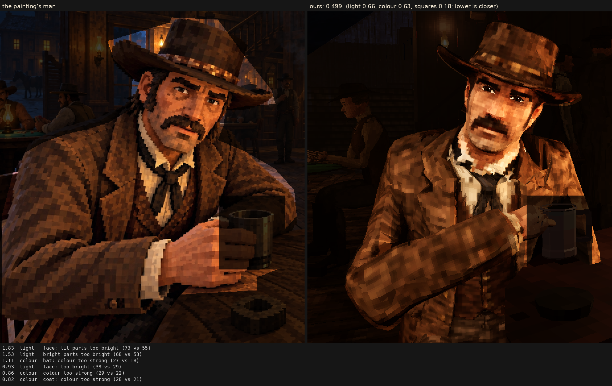

# Character judge, 2026-10-07_r10

his face modelled: his own shape's shadows (tools/blender/bake_ao.py; bake.face ao_near 0.5, ao_far 0.8), 60 % of the light baked into his face taken out (even), bold brows from his landmarks set 3 mm lower (bake.brows), a mottled warm stubble on his jaw (bake.beard), calmer clearer eyes (a bigger iris, a smaller glint, less shade in the whites), his face's squares each a shade off the next (CELLS mottle 0.1); main's light, as r8: r7's man under it 0.555, with the light corrected the simple way 0.223 to now's 0.214

Score **0.499** (the mean severity; lower is closer): light 0.660, colour 0.631, squares 0.184. From `docs/screenshots/tripo/judge/renders/face_modelled`, against the man in `saloon-blocks.png`.

| Severity | Group | Difference |
|---|---|---|
| 1.83 | light | face: lit parts too bright (73 vs 55) |
| 1.53 | light | bright parts too bright (68 vs 53) |
| 1.11 | colour | hat: colour too strong (27 vs 18) |
| 0.93 | light | face: too bright (38 vs 29) |
| 0.86 | colour | colour too strong (29 vs 22) |
| 0.82 | colour | coat: colour too strong (28 vs 21) |
| 0.81 | colour | too yellow (23 vs 17) |
| 0.62 | light | too little deep shadow (share under L* 10) (0.24 vs 0.31) |
| 0.61 | light | too much blown highlight (share over L* 80) (0.019 vs 0.001) |
| 0.56 | colour | face: colour too strong (39 vs 34) |
| 0.54 | light | coat: lit parts too bright (46 vs 40) |
| 0.51 | squares | edges too hard (0.31 vs 0.25) |
| 0.44 | light | hat: too bright (17 vs 13) |
| 0.42 | squares | grain in his flat parts (5.0 vs 4.4 dE) |
| 0.39 | colour | bright parts too pale (chroma-L* correlation) (0.81 vs 0.89) |
| 0.30 | squares | squares too different from their neighbours (7.4 vs 6.5) |
| 0.26 | colour | palette: the painting's colours we lack (1.6 dE) |
| 0.25 | light | midtones too bright (20 vs 17) |
| 0.24 | light | coat: too bright (19 vs 17) |
| 0.24 | colour | palette: colours the painting lacks (1.4 dE) |
| 0.20 | squares | squares flatter than the painting's (one tone, edge to edge) (0.61 vs 0.59) |
| 0.19 | light | hat: lit parts too bright (36 vs 34) |
| 0.09 | squares | hat: squares smaller (7.7 vs 8.0 px) |
| 0.09 | squares | coat: squares bigger (8.6 vs 8.3 px) |
| 0.08 | light | shadows too light (2 vs 1) |
| 0.02 | squares | squares bigger than the painting's (8.3 vs 8.2 px) |
| 0.02 | squares | face: squares bigger (7.4 vs 7.4 px) |
| 0.01 | squares | noisier than paint (coherence 0.21 vs 0.21) |

