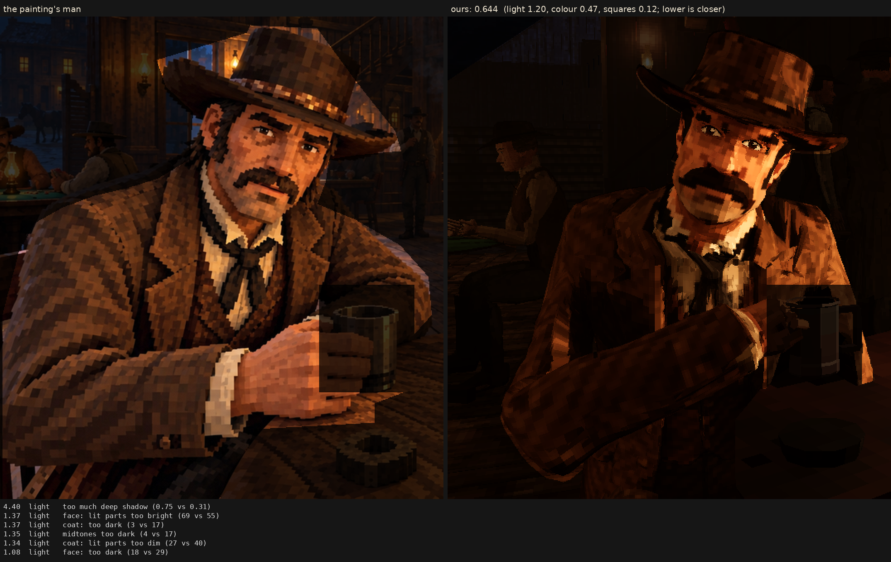

# Character judge, 2026-10-07_r3

r2's man without the art session's light (the branch as it stands; r4's man so: 0.666)

Score **0.644** (the mean severity; lower is closer): light 1.202, colour 0.469, squares 0.117. From `docs/screenshots/tripo/judge/renders/weave`, against the man in `saloon-blocks.png`.

| Severity | Group | Difference |
|---|---|---|
| 4.40 | light | too much deep shadow (0.75 vs 0.31) |
| 1.37 | light | face: lit parts too bright (69 vs 55) |
| 1.37 | light | coat: too dark (3 vs 17) |
| 1.35 | light | midtones too dark (4 vs 17) |
| 1.34 | light | coat: lit parts too dim (27 vs 40) |
| 1.08 | light | face: too dark (18 vs 29) |
| 1.04 | colour | coat: colour too weak (13 vs 21) |
| 0.87 | light | hat: too dark (4 vs 13) |
| 0.75 | light | hat: lit parts too dim (26 vs 34) |
| 0.74 | colour | colour too weak (chroma) (17 vs 22) |
| 0.61 | colour | too blue/grey (b*) (12 vs 17) |
| 0.44 | light | bright parts too dim (48 vs 53) |
| 0.41 | colour | palette: the painting's colours we lack (2.5 dE) |
| 0.35 | colour | palette: colours the painting lacks (2.1 dE) |
| 0.35 | squares | squares flatter than the painting's (one tone, edge to edge) (0.62 vs 0.59) |
| 0.30 | colour | hat: colour too weak (16 vs 18) |
| 0.27 | squares | squares too alike (a smooth surface) (5.7 vs 6.5) |
| 0.20 | light | too much blown highlight (share over L* 80) (0.007 vs 0.001) |
| 0.17 | colour | face: colour too weak (33 vs 34) |
| 0.14 | squares | hat: squares smaller (7.6 vs 8.0 px) |
| 0.13 | colour | bright parts too colourful (0.92 vs 0.89) |
| 0.13 | squares | squares smaller than the painting's (7.8 vs 8.2 px) |
| 0.13 | squares | face: squares smaller (7.0 vs 7.4 px) |
| 0.05 | light | shadows too deep (0 vs 1) |
| 0.02 | squares | edges too hard (0.26 vs 0.25) |
| 0.01 | squares | coat: squares bigger (8.3 vs 8.3 px) |
| 0.00 | squares | noisier than paint (coherence 0.38 vs 0.21) |
| 0.00 | squares | grain in his flat parts (1.8 vs 4.4 dE) |

