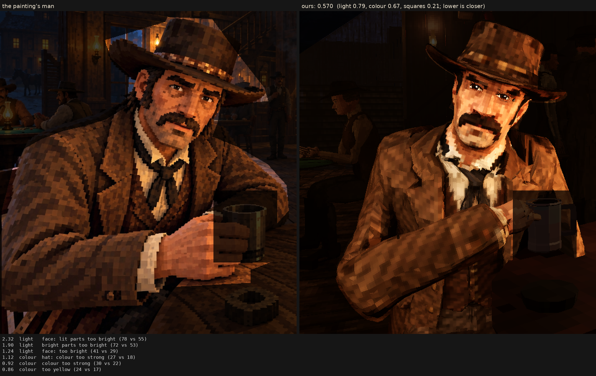

# Character judge, 2026-10-07_r4

his face back in the painting's style (Sean: too cartoony): his paint worn on the Rodin man as made (people.json shape), his eyes at their own size in warm whites, no darker-part rule or calm on his head, the painter's light kept in his skin, his face's squares 7 mm; the same light as r1

Score **0.570** (the mean severity; lower is closer): light 0.794, colour 0.671, squares 0.206. From `docs/screenshots/tripo/judge/renders/face_style`, against the man in `saloon-blocks.png`.

| Severity | Group | Difference |
|---|---|---|
| 2.32 | light | face: lit parts too bright (78 vs 55) |
| 1.90 | light | bright parts too bright (72 vs 53) |
| 1.24 | light | face: too bright (41 vs 29) |
| 1.12 | colour | hat: colour too strong (27 vs 18) |
| 0.92 | colour | colour too strong (30 vs 22) |
| 0.86 | colour | too yellow (24 vs 17) |
| 0.86 | colour | coat: colour too strong (28 vs 21) |
| 0.76 | light | too much blown highlight (share over L* 80) (0.023 vs 0.001) |
| 0.69 | light | too little deep shadow (share under L* 10) (0.24 vs 0.31) |
| 0.68 | colour | face: colour too strong (40 vs 34) |
| 0.54 | squares | squares flatter than the painting's (one tone, edge to edge) (0.64 vs 0.59) |
| 0.50 | squares | edges too hard (0.30 vs 0.25) |
| 0.49 | light | coat: lit parts too bright (45 vs 40) |
| 0.42 | light | hat: too bright (17 vs 13) |
| 0.42 | colour | bright parts too pale (chroma-L* correlation) (0.81 vs 0.89) |
| 0.36 | squares | squares too different from their neighbours (7.5 vs 6.5) |
| 0.30 | light | midtones too bright (20 vs 17) |
| 0.29 | light | coat: too bright (20 vs 17) |
| 0.27 | colour | palette: the painting's colours we lack (1.6 dE) |
| 0.24 | colour | palette: colours the painting lacks (1.4 dE) |
| 0.24 | squares | grain in his flat parts (4.8 vs 4.4 dE) |
| 0.23 | light | hat: lit parts too bright (36 vs 34) |
| 0.10 | squares | hat: squares smaller (7.7 vs 8.0 px) |
| 0.10 | squares | coat: squares bigger (8.6 vs 8.3 px) |
| 0.09 | light | shadows too light (2 vs 1) |
| 0.01 | squares | squares smaller than the painting's (8.2 vs 8.2 px) |
| 0.00 | squares | noisier than paint (coherence 0.22 vs 0.21) |
| 0.00 | squares | face: squares bigger (7.4 vs 7.4 px) |

