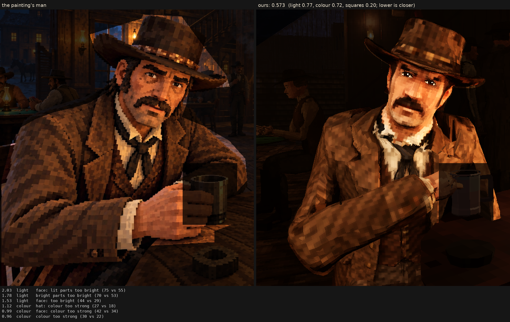

# Character judge, 2026-10-07_r5

his face from his model's own colours (bake.face: all of his head under the hat from the Rodin man as made, graded to the painter's skin, his lips toned, a quarter of the painter's colours mixed back in): the painter's face was a game portrait; the same light as r1

Score **0.573** (the mean severity; lower is closer): light 0.774, colour 0.718, squares 0.199. From `docs/screenshots/tripo/judge/renders/own_face`, against the man in `saloon-blocks.png`.

| Severity | Group | Difference |
|---|---|---|
| 2.03 | light | face: lit parts too bright (75 vs 55) |
| 1.78 | light | bright parts too bright (70 vs 53) |
| 1.53 | light | face: too bright (44 vs 29) |
| 1.12 | colour | hat: colour too strong (27 vs 18) |
| 0.99 | colour | face: colour too strong (42 vs 34) |
| 0.96 | colour | colour too strong (30 vs 22) |
| 0.89 | colour | too yellow (24 vs 17) |
| 0.86 | colour | coat: colour too strong (28 vs 21) |
| 0.72 | light | too little deep shadow (share under L* 10) (0.23 vs 0.31) |
| 0.62 | light | too much blown highlight (share over L* 80) (0.019 vs 0.001) |
| 0.56 | squares | squares flatter than the painting's (one tone, edge to edge) (0.64 vs 0.59) |
| 0.52 | squares | edges too hard (0.31 vs 0.25) |
| 0.49 | light | coat: lit parts too bright (45 vs 40) |
| 0.42 | light | hat: too bright (17 vs 13) |
| 0.39 | colour | bright parts too pale (chroma-L* correlation) (0.81 vs 0.89) |
| 0.32 | light | midtones too bright (20 vs 17) |
| 0.29 | light | coat: too bright (20 vs 17) |
| 0.28 | colour | palette: colours the painting lacks (1.7 dE) |
| 0.26 | squares | squares too different from their neighbours (7.3 vs 6.5) |
| 0.25 | colour | palette: the painting's colours we lack (1.5 dE) |
| 0.22 | light | hat: lit parts too bright (36 vs 34) |
| 0.16 | squares | grain in his flat parts (4.6 vs 4.4 dE) |
| 0.10 | squares | coat: squares bigger (8.6 vs 8.3 px) |
| 0.09 | light | shadows too light (2 vs 1) |
| 0.08 | squares | face: squares bigger (7.6 vs 7.4 px) |
| 0.08 | squares | hat: squares smaller (7.8 vs 8.0 px) |
| 0.03 | squares | squares bigger than the painting's (8.3 vs 8.2 px) |
| 0.00 | squares | noisier than paint (coherence 0.23 vs 0.21) |

