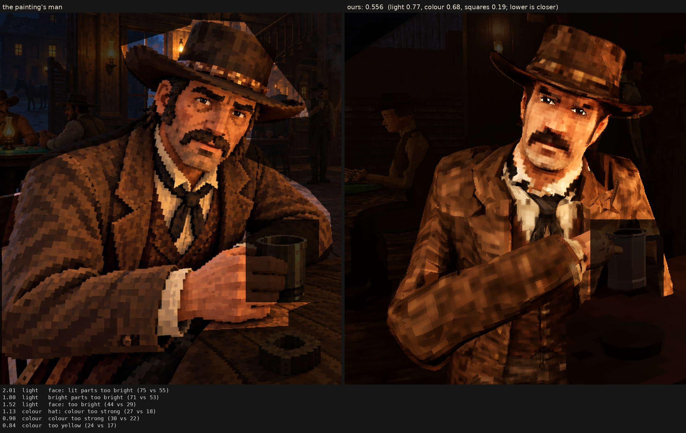

# Character judge, 2026-10-07_r7

his squares: a faint grain inside them (1.0 L* on his head, 1.2 on his body, 1.6 texels across), his face's triangles within 60 degrees of ahead on the front plane, the coat's tweed as each square's own shade run into its neighbours' (no rows), the lines between planes settled; the same light as r1

Score **0.556** (the mean severity; lower is closer): light 0.771, colour 0.675, squares 0.189. From `docs/screenshots/tripo/judge/renders/grain`, against the man in `saloon-blocks.png`.

| Severity | Group | Difference |
|---|---|---|
| 2.01 | light | face: lit parts too bright (75 vs 55) |
| 1.80 | light | bright parts too bright (71 vs 53) |
| 1.52 | light | face: too bright (44 vs 29) |
| 1.13 | colour | hat: colour too strong (27 vs 18) |
| 0.90 | colour | colour too strong (30 vs 22) |
| 0.84 | colour | too yellow (24 vs 17) |
| 0.82 | colour | coat: colour too strong (28 vs 21) |
| 0.80 | colour | face: colour too strong (40 vs 34) |
| 0.66 | light | too little deep shadow (share under L* 10) (0.24 vs 0.31) |
| 0.64 | light | too much blown highlight (share over L* 80) (0.020 vs 0.001) |
| 0.58 | light | coat: lit parts too bright (46 vs 40) |
| 0.52 | squares | edges too hard (0.31 vs 0.25) |
| 0.45 | light | hat: too bright (17 vs 13) |
| 0.39 | colour | bright parts too pale (chroma-L* correlation) (0.81 vs 0.89) |
| 0.37 | squares | grain in his flat parts (4.9 vs 4.4 dE) |
| 0.32 | squares | squares too different from their neighbours (7.4 vs 6.5) |
| 0.29 | colour | palette: the painting's colours we lack (1.7 dE) |
| 0.27 | light | midtones too bright (20 vs 17) |
| 0.24 | light | coat: too bright (19 vs 17) |
| 0.24 | squares | squares flatter than the painting's (one tone, edge to edge) (0.61 vs 0.59) |
| 0.23 | colour | palette: colours the painting lacks (1.4 dE) |
| 0.22 | light | hat: lit parts too bright (36 vs 34) |
| 0.10 | squares | hat: squares smaller (7.7 vs 8.0 px) |
| 0.09 | light | shadows too light (2 vs 1) |
| 0.09 | squares | coat: squares bigger (8.6 vs 8.3 px) |
| 0.04 | squares | face: squares bigger (7.5 vs 7.4 px) |
| 0.02 | squares | squares bigger than the painting's (8.3 vs 8.2 px) |
| 0.00 | squares | noisier than paint (coherence 0.21 vs 0.21) |

