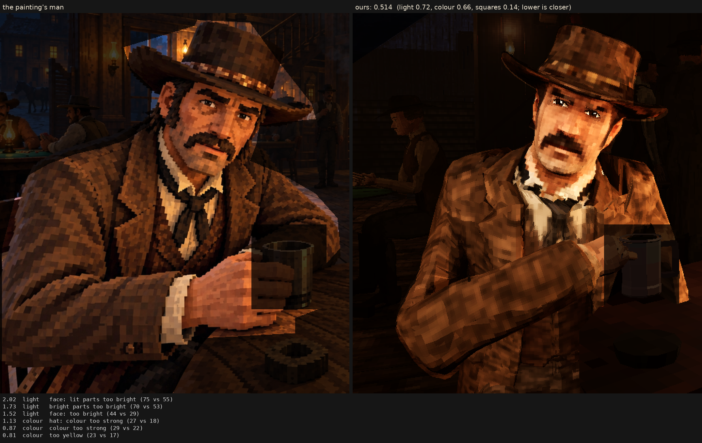

# Character judge, 2026-10-07_r8

tried, not kept: his clothes filtered with his model's own colours as the guide (bake.cloth: the painter's garment colours, the model's folds and seams; the painter's streaky tweed gone); main's light (art merge 2, now on this branch); r7's man under it: 0.555

Score **0.514** (the mean severity; lower is closer): light 0.717, colour 0.656, squares 0.138. From `docs/screenshots/tripo/judge/renders/cloth`, against the man in `saloon-blocks.png`.

| Severity | Group | Difference |
|---|---|---|
| 2.02 | light | face: lit parts too bright (75 vs 55) |
| 1.73 | light | bright parts too bright (70 vs 53) |
| 1.52 | light | face: too bright (44 vs 29) |
| 1.13 | colour | hat: colour too strong (27 vs 18) |
| 0.87 | colour | colour too strong (29 vs 22) |
| 0.81 | colour | too yellow (23 vs 17) |
| 0.80 | colour | face: colour too strong (41 vs 34) |
| 0.78 | colour | coat: colour too strong (28 vs 21) |
| 0.62 | light | too little deep shadow (share under L* 10) (0.24 vs 0.31) |
| 0.53 | light | too much blown highlight (share over L* 80) (0.017 vs 0.001) |
| 0.50 | squares | edges too hard (0.31 vs 0.25) |
| 0.46 | light | hat: too bright (17 vs 13) |
| 0.36 | colour | bright parts too pale (chroma-L* correlation) (0.82 vs 0.89) |
| 0.33 | squares | squares flatter than the painting's (one tone, edge to edge) (0.62 vs 0.59) |
| 0.27 | colour | palette: colours the painting lacks (1.6 dE) |
| 0.25 | light | midtones too bright (20 vs 17) |
| 0.23 | light | coat: lit parts too bright (43 vs 40) |
| 0.23 | colour | palette: the painting's colours we lack (1.4 dE) |
| 0.22 | light | hat: lit parts too bright (36 vs 34) |
| 0.22 | light | coat: too bright (19 vs 17) |
| 0.17 | squares | squares too different from their neighbours (7.0 vs 6.5) |
| 0.10 | squares | hat: squares smaller (7.7 vs 8.0 px) |
| 0.09 | light | shadows too light (2 vs 1) |
| 0.07 | squares | coat: squares bigger (8.5 vs 8.3 px) |
| 0.04 | squares | face: squares bigger (7.5 vs 7.4 px) |
| 0.03 | squares | grain in his flat parts (4.4 vs 4.4 dE) |
| 0.00 | squares | noisier than paint (coherence 0.24 vs 0.21) |
| 0.00 | squares | squares smaller than the painting's (8.2 vs 8.2 px) |

