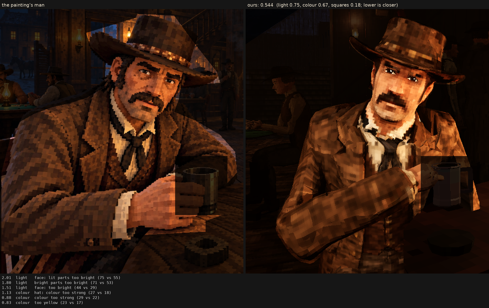

# Character judge, 2026-10-07_r9

tried, not kept: his clothes filtered with his model's own L* as the guide (eps 0.0008) and the painter's strong drawing given back (keep 3.2-4.5 L* over 1.2 cm: the vest's check and buttons, boot laces, hands); the same light as r8. With the light corrected the simple way it scores 0.231 to r7's man's 0.223, and in the shot and close up it looks as he did, so he stays r7's

Score **0.544** (the mean severity; lower is closer): light 0.752, colour 0.666, squares 0.181. From `docs/screenshots/tripo/judge/renders/cloth_lstar`, against the man in `saloon-blocks.png`.

| Severity | Group | Difference |
|---|---|---|
| 2.01 | light | face: lit parts too bright (75 vs 55) |
| 1.80 | light | bright parts too bright (71 vs 53) |
| 1.51 | light | face: too bright (44 vs 29) |
| 1.13 | colour | hat: colour too strong (27 vs 18) |
| 0.88 | colour | colour too strong (29 vs 22) |
| 0.83 | colour | too yellow (23 vs 17) |
| 0.80 | colour | face: colour too strong (40 vs 34) |
| 0.79 | colour | coat: colour too strong (28 vs 21) |
| 0.64 | light | too much blown highlight (share over L* 80) (0.020 vs 0.001) |
| 0.60 | light | too little deep shadow (share under L* 10) (0.25 vs 0.31) |
| 0.51 | light | coat: lit parts too bright (46 vs 40) |
| 0.51 | squares | edges too hard (0.31 vs 0.25) |
| 0.45 | light | hat: too bright (17 vs 13) |
| 0.40 | colour | bright parts too pale (chroma-L* correlation) (0.81 vs 0.89) |
| 0.31 | squares | squares too different from their neighbours (7.4 vs 6.5) |
| 0.30 | squares | grain in his flat parts (4.9 vs 4.4 dE) |
| 0.28 | colour | palette: colours the painting lacks (1.7 dE) |
| 0.26 | squares | squares flatter than the painting's (one tone, edge to edge) (0.61 vs 0.59) |
| 0.25 | light | midtones too bright (20 vs 17) |
| 0.22 | colour | palette: the painting's colours we lack (1.3 dE) |
| 0.21 | light | hat: lit parts too bright (36 vs 34) |
| 0.21 | light | coat: too bright (19 vs 17) |
| 0.10 | squares | hat: squares smaller (7.7 vs 8.0 px) |
| 0.09 | squares | coat: squares bigger (8.5 vs 8.3 px) |
| 0.08 | light | shadows too light (2 vs 1) |
| 0.04 | squares | face: squares bigger (7.5 vs 7.4 px) |
| 0.02 | squares | squares bigger than the painting's (8.3 vs 8.2 px) |
| 0.00 | squares | noisier than paint (coherence 0.22 vs 0.21) |

